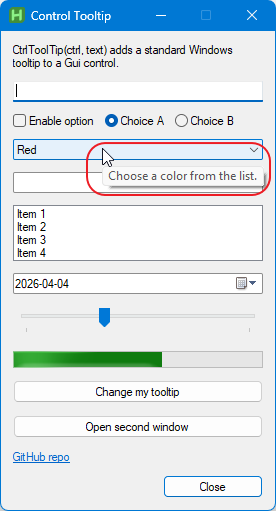

# CtrlToolTip

`CtrlToolTip` is a small [AutoHotkey](https://www.autohotkey.com/) v2 helper that adds a standard Windows tooltip to a `Gui.Control`.

It uses the native [tooltips_class32](https://learn.microsoft.com/en-us/windows/win32/controls/tooltip-controls) control, keeps the API minimal, and works with multiple GUI windows.



## Why This Exists

AutoHotkey GUI controls do not provide a small built-in helper for attaching standard Windows tooltips in a simple, reusable way.

This project exists to keep that job minimal:

- one function
- native Windows tooltip control
- no extra class structure required for basic use

## Requirements

- [AutoHotkey v2](https://www.autohotkey.com/)
- Windows

## Files

- `CtrlToolTip.ahk` - the helper function
- `CtrlToolTip_sample.ahk` - example GUI showing different control types

## Usage

Include the file:

```ahk
#Include CtrlToolTip.ahk
```

Add a tooltip to any GUI control:

```ahk
myGui := Gui()
btnSave := myGui.AddButton("w120", "Save")
CtrlToolTip(btnSave, "Save your changes.")
myGui.Show()
```

## Function

```ahk
CtrlToolTip(ctrl, text)
```

- `ctrl` - target `Gui.Control`
- `text` - tooltip text shown when the mouse hovers the control

## Features

- Uses the standard Windows tooltip control
- Very small API: one function
- Automatically updates the tooltip text if called again for the same control
- Automatically applies `SS_NOTIFY` to `Text` controls so tooltips work there too
- Keeps tooltip handles per GUI window

## Example: Change Tooltip Text

```ahk
btnChange := myGui.AddButton("w180", "Change my tooltip")
CtrlToolTip(btnChange, "Initial tooltip")

btnChange.OnEvent("Click", ChangeTip)

ChangeTip(ctrl, *) {
    CtrlToolTip(ctrl, "Tooltip changed after click.")
}
```

## Notes

- `Text` controls usually need `SS_NOTIFY` for hover-related behavior. This helper applies it automatically.
- In the sample, the `Slider` control uses AHK's own `ToolTip` option and `CtrlToolTip` together. In real use, you may prefer only one of them.
- The helper sets the maximum tooltip width using `A_ScreenWidth`.

## Sample

Run:

```ahk
CtrlToolTip_sample.ahk
```

The sample demonstrates:

- `Text`
- `Edit`
- `CheckBox`
- `Radio`
- `DropDownList`
- `ComboBox`
- `ListBox`
- `DateTime`
- `Slider`
- `Progress`
- `Link`
- A button that changes its own tooltip
- A second GUI window with its own tooltips

## License

See the [LICENSE](LICENSE) file for license details.
